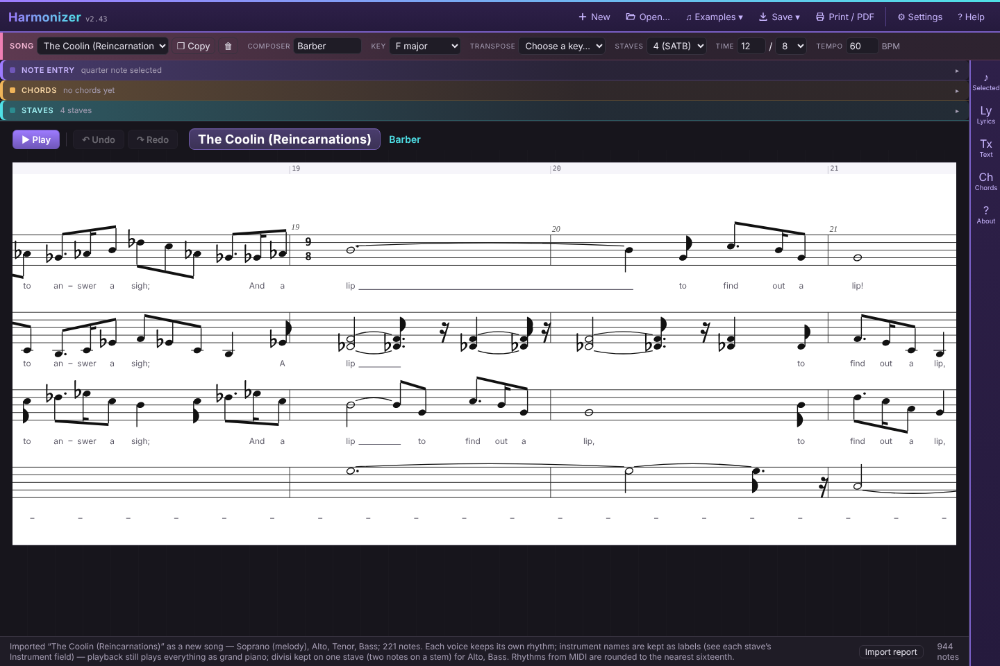
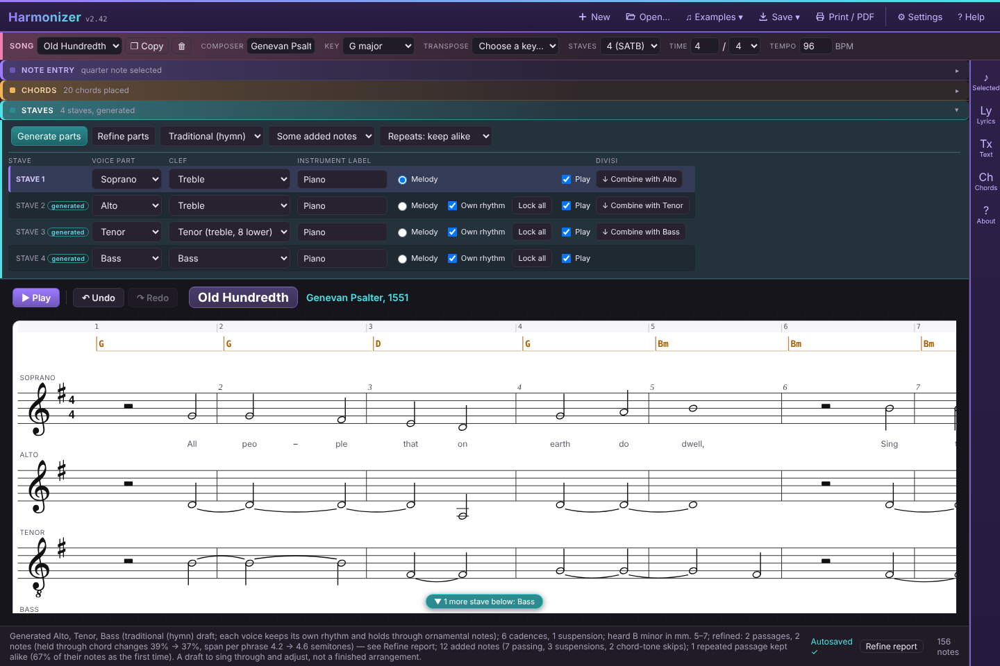

# Harmonizer

**A workbench for roughing out vocal arrangements.** Sketch a melody, place chords above it, and let Harmonizer generate SATB parts underneath. Then play it back on a real piano sound and edit any note until it sounds right.

**▶ Try it now: [dffmonolith.github.io/harmonizer](https://dffmonolith.github.io/harmonizer/)**. It runs in your browser with nothing to install.



## What it does

- **Note entry**: click or drag on the staff, or type a compact text notation. Lyrics support up to six verses.
- **Generate parts**: fills in the other voices with real part-writing rules. It handles cadences, voice leading, prepared suspensions and local key changes, steers clear of parallel, contrary and hidden fifths and octaves, overlapping voices, cross-relations and augmented seconds, and offers Close harmony, Traditional/hymn and Open/wide styles. The tune can move to another voice for a verse, or drop out for chords-only passages, and any measures can be rewritten on their own. Refine parts reworks the voices as lines, with passing and neighbour notes and suspensions where the melody holds. [How it reasons (PDF)](docs/harmonizer-partwriting-guide.pdf)
- **Choral notation**: fermatas, breaths, tempo words, rit./accel., dynamics and hairpins, articulations, rehearsal letters, repeats and endings, D.C./D.S./Coda. All of them affect playback.
- **Import**: MusicXML (including compressed `.mxl` from MuseScore, Finale or Sibelius) and MIDI. An import report shows what came across.
- **Export**: `.json`, `.musicxml`, `.mid`, `.wav`, print/PDF, and **rehearsal tracks**, a `.zip` with one WAV per voice.
- **Practice**: a play window with loop, practice speed, and jumping to a rehearsal letter. Range warnings, optional partwriting marks (parallels, hidden and contrary fifths/octaves, overlaps, cross-relations, augmented seconds) and marks over locked and generated notes help as you write.
- Autosaves in your browser, per song, with undo/redo and a full library backup.

It's deliberately not an engraver. It handles whole through eighth notes, dots, and simple triplets, and exports to MusicXML when you want to finish in real notation software.



## Getting started

- [Quickstart](https://dffmonolith.github.io/harmonizer/quickstart.html)
- [Full user guide](https://dffmonolith.github.io/harmonizer/guide.html)

### Running it yourself

Harmonizer is a single HTML file (`app/harmonizer.html`) of vanilla JavaScript with no build step and no dependencies. It needs two things beside it:

- `app/harmonizer-piano-samples.json`: the piano sound
- `data/`: the Examples menu (optional)

Browsers block a page opened by double-clicking from loading those files, so serve the folder from any static web server instead. For example, from the repository root:

```
python -m http.server 8000
```

Then open <http://localhost:8000/app/harmonizer.html>.

## Tests

`app/tests/` holds a standing test suite: dependency-free logic tests, plus a browser end-to-end test that runs if [Playwright](https://playwright.dev) is installed.

```
node app/tests/run-all.js
```

See [app/tests/README.md](app/tests/README.md) for details.

## Credits

- Piano: [Salamander Grand Piano](https://archive.org/details/SalamanderGrandPianoV3) by Alexander Holm, CC BY 3.0
- Clefs and accidentals: glyph outlines from the Bravura font (SMuFL, © Steinberg Media Technologies), SIL Open Font License 1.1
- Example arrangements in `data/` are MIDI renderings of choral works by Barber, Bruckner, Byrd and Morley.

## License

[MIT](LICENSE) © dffmonolith
